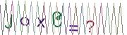

# Myanmar Math CAPTCHA

[](https://travis-ci.org/nayzawoo/mmrcaptcha)

PHP Math CAPTCHA with Myanmar Font





# Requirements

- PHP >= 5.4
- GD Library (>=2.0) [or] Imagick PHP extension (>=6.5.7)

# Installation
	
	composer require nayzawoo/mmrcaptcha

# Usage
## Create Captcha Image

```php
<?php

require 'vendor/autoload.php';

use MyanmarCaptcha\Captcha;
use MyanmarCaptcha\CaptchaString;

$captcha = new Captcha(new CaptchaString);
$captcha = $captcha
    ->width(180)
    ->height(50)
    ->fontSize(40)
    ->fontPath(__DIR__.'/src/assets/mon3.ttf')
    ->textColor("#000000")
    ->backgroundColor("#FFFFFF")
    ->backgroundImage("./src/assets/bg1.png")
    ->horizontalLines(5)
    ->disableDistortion()
    ->dots(2000)
    ->verticalLines(20)
    ->invert()
    ->build();

$imageQuality = 100;
echo $captcha->response('jpg', $imageQuality);
```

## Check Answer

```php
$captcha->getAnswer(); // 20
$captcha->check(20); // true
$captcha->check(5); // false
```

# Testing

	$ ./vendor/bin/phpunit

# License

This library is released under the MIT License. See [License](LICENSE) file for more details.
